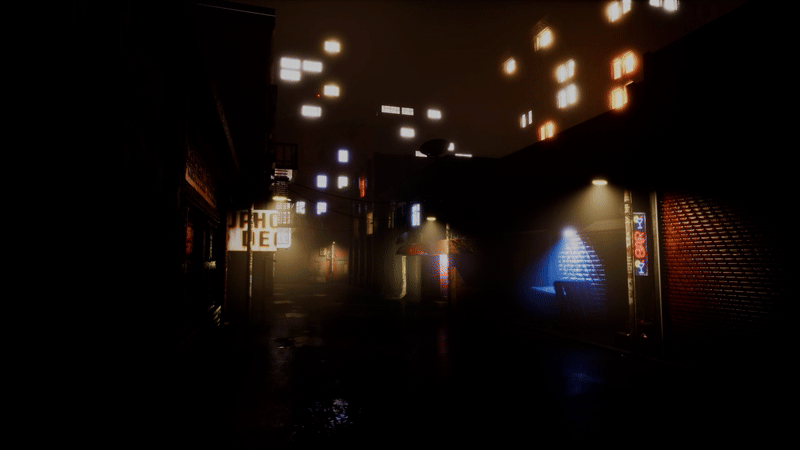

# UE5 Procedural City & Weather Architecture

> **View the full 4K High-Fidelity Showcase:** [https://www.youtube.com/watch?v=PF5UTIv-ig0] | [Bilibili Link Here]

## 📖 Abstract

This project serves as a **technical demonstration** of a scalable, procedurally generated city pipeline and a dynamic weather system within Unreal Engine 5. 

Leveraging **10+ years of Graphics Programming experience (OpenGL/Vulkan)**, this repository focuses on the *engineering challenges* of rendering large-scale environments. It bridges the gap between raw C++ optimization and high-level Technical Art workflows, featuring:

* **Procedural Content Generation (PCG):** Deterministic city layout generation with collision handling and logic-driven prop placement.
* **Dynamic Weather System:** A unified Master Material workflow for real-time wetness accumulation, coupled with Niagara-based volumetric rain.
* **Performance Optimization:** Custom C++ render state management (Skylight/Cloud interaction) and World Partition HLOD strategies for stable framerates.

> **⚠️ Repository Note:** > Due to copyright restrictions and file size limits of high-fidelity assets (Quixel Megascans / City Sample), this repository hosts the **Core Logic, Source Code, Material Graphs, and Blueprints**. It is intended to demonstrate *system architecture* and *implementation logic*.