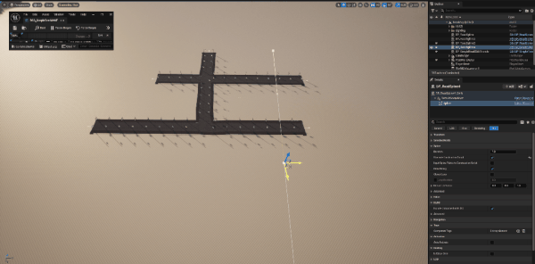
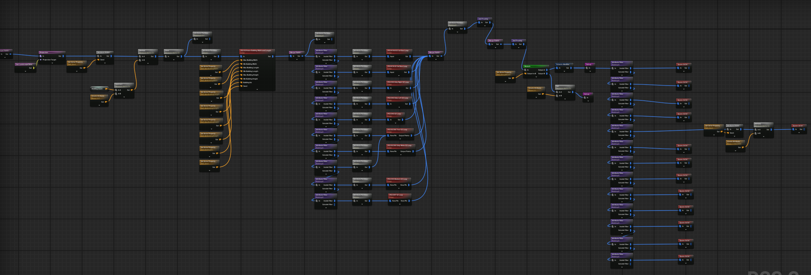

> **View the full Showcase:** [YouTube Link Here](https://www.youtube.com/watch?v=PF5UTIv-ig0) | [Bilibili Link Here](https://www.bilibili.com/video/BV1LErDBBEio/)

## 📖 Abstract

This project is a **technical demo** of a procedural city pipeline and a dynamic weather system in Unreal Engine 5.

I have **10+ years of experience in Graphics Programming (OpenGL/Vulkan)**. This repository focuses on the *engineering challenges* of rendering large environments. It combines C++ optimization with Technical Art workflows, featuring:

* **PCG & Graph Algorithms:** A hierarchical city generation system that solves layout constraints in the editor.
* **Rendering & Shader Pipeline:** Solutions for common rendering artifacts (like tiling) and a physically consistent water/weather system.
* **System Architecture:** A hybrid design using **Blueprints for logic** and **C++ for performance optimization**.

> **⚠️ Repository Note:** Due to copyright and file size limits of assets (Quixel / City Sample), this repository only contains the **Core Logic, Source Code, Material Graphs, and Blueprints**. The purpose is to show my *system architecture* and *implementation logic*.

## 🛠️ Technical Architecture & Key Features

### 1. PCG & Graph Algorithms
The city layout uses a **hierarchical and deterministic PCG system**. It covers everything from generating a single building to a whole region. This system works as an interactive tool for level design.

* **Layer 1: Spline-Based Road Network (Topology Solver)**
    * **Graph Logic:** Automatically generates static mesh roads along user-defined splines.
    * **Intersection Solving:** Implemented a check to find spline branches. The system detects if a node is a 3-way or 4-way intersection and spawns the correct crossroad mesh.
    * **Scatter Logic:** Automatically places roadside assets (street lamps, trash cans) based on the road length and curve density.

* **Layer 2: Parametric Building Modules (Subgraph System)**
    * **Modular Design:** Created a library of **12 architectural styles**. Each style is an independent PCG Subgraph.
    * **Procedural Assembly:** Buildings are dynamic. I exposed parameters like `Width`, `Length`, and `Height` for each style. The system can generate variations from small shops to skyscrapers using the same logic.
    * **Material Variation:** Added logic to randomize window lights and wall materials for each building.

* **Layer 3: Region-Based City Layout (Region Manager)**
    * **Constraint Solving:** A master PCG graph that fills closed spline regions with the building modules mentioned above.
    * **Self-Intersection Check:** The graph acts as a manager. It runs a **bounds-check loop** to make sure generated buildings do not overlap.

* **Layer 4: Background Proxy with Collision Check**
    * **Data Interaction:** The generator for distant buildings reads the **Road Spline Data** to create an "Exclusion Zone."
    * **Result:** Simple cubes are automatically removed if they overlap with the roads. This shows **data communication** between the road system and the building system.

| **Spline Road Generation (Layer 1)** | **Region City Layout (Layer 3)** |
| :---: | :---: |
|  |  |
| *Real-time intersection solving* | *Constraint-based building scattering* |

<strong>🔍 Click to view PCG Graph Logic (Under the Hood)</strong>

> **Intersection Solver Logic:**
> This image shows the math to calculate spline tangents and check node types (3-way vs 4-way) to spawn the correct mesh.
> 
>
> **Attribute-Driven Building Dispatcher:**
> Scatters buildings within a Spline Region, randomizing **Dimensions** and using a **Self-Intersection Check** to prevent overlap.
> 

### 2. Rendering & Shader Pipeline (Tech Art)
I focused on fixing common rendering artifacts and using modern UE5 shading features for correct physical results.

* **Smart Landscape Materials:**
    * **Auto-Material Logic:** The material automatically applies layers based on **Height** (Snow at peaks, Sand at low levels) and **Slope** (Rock on cliffs, Grass on flats).
    * **Fixing Texture Repetition:** Large terrains often look repetitive. I wrote a shader function that uses **Distance-Based UV Scaling** and **Macro Variation** (Noise) to break up the tiling pattern.

* **Hybrid Rain System (Materials & Niagara):**
    * **Material Functions:** Encapsulated effects (Drops, Drips, Puddles, Wet Surface) into separate functions. This allows for selective integration (e.g., only applying "Wet Surface" to distant buildings) to save performance. 
    * **Niagara Rain Simulation:** Implemented a dual-layer particle system for **Falling Drops** (volumetric streaks) and **Ground Splashes** (collision impacts).
    * **Adaptive Splash Logic:** Material "RainDrops" aren't noticeable at long distances. To fix this, splash particles **scale up with camera distance** (starting >1m away) to ensure rain impacts remain visible in wide shots.

* **Water & Dual-Layer Lightning System:**
    * **SingleLayerWater:** Used UE's `SingleLayerWater` shading model for the river. This gives accurate light scattering and depth absorption compared to basic translucent materials.
    * **Procedural Bolt (Plane 1):** The lightning shape is rendered on a mesh plane using a dynamic material. A `Progress` parameter drives the animation at runtime to simulate the strike.
    * **Atmospheric Flash (Plane 2):** To simulate the blinding flash, a second emissive plane is generated in front of the camera. A Blueprint updates its position every frame to ensure the flash is naturally **blocked by foreground objects**, creating realistic depth compared to a flat Post-Process exposure boost.

> *Figure: Real-time `SingleLayerWater` rendering and procedural landscape layers during the day cycle.*

### 3. System Architecture & Performance
A hybrid architecture utilizing **Blueprints for logic** and **C++ for engine optimization**.

* **Extended Day/Night Cycle (Blueprint):**
    * The standard `SunPosition` plugin only calculates solar angles. I built a **Manager System** that maps time-of-day to **Float Curves**.
    * This allows artists to dynamically drive Skylight, Fog, and Sun Intensity, creating specific moods (e.g., "Golden Hour") that the default plugin cannot support.

* **Skylight Optimization (C++ & Render Pipeline):**
    * **Problem:** `RealTimeCapture` causes ~20ms frame spikes. Switching to manual `RecaptureSky` saves performance but creates visual inconsistencies because it **includes Volumetric Fog** (which Real-Time mode ignores).
    * **Solution:** I investigated the engine source code and implemented an **`ISceneViewExtension`**. It disables Volumetric Fog *only* during the capture frame. This ensures the manual capture looks identical to the real-time version but with much better performance.

* **World Partition HLOD Strategy:**
    * **Hybrid HLODs:** Used **Approximation** for buildings (to fix Z-fighting/DrawCalls) and **Instancing** for small props.
    * **Custom Shader:** Modified the default **HLOD Material** to support Emissive textures, solving the engine bug where distant cities lose their window lights at night.

## 🤝 Credits & Acknowledgements

* **3D Assets:** The high-fidelity buildings and props are sourced from the **Matrix Awakens City Sample** and **Quixel Megascans**.
* **Core Focus:** This repository represents my original work on the **C++ Source Code, PCG Graphs, and Shader Logic**.
* **Engine:** Built with **Unreal Engine 5.5**.

---
*Thank you for reviewing the technical documentation.*
